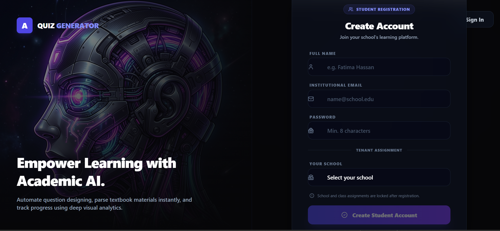
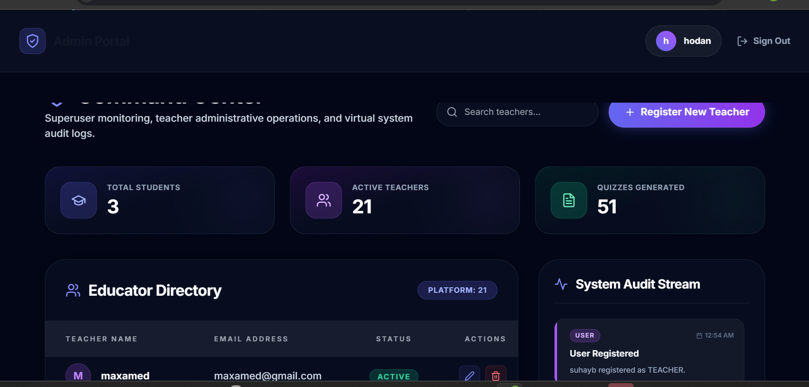
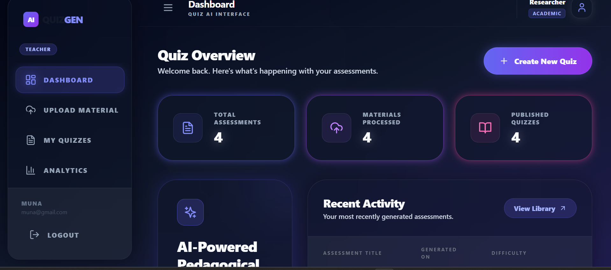
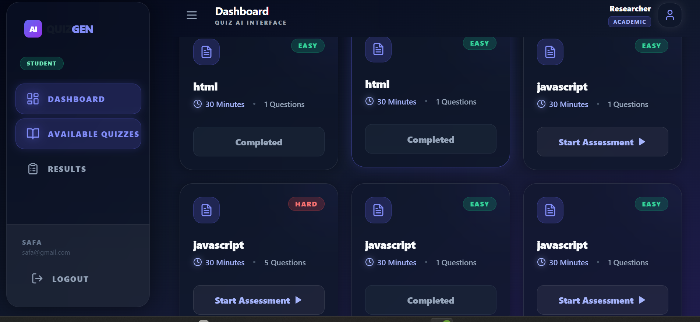

# 🧠 Instant Student Quiz Generator (Academic AI)

An advanced, AI-powered educational assessment platform designed to help students evaluate their learning retention instantly. By analyzing uploaded PDFs or text documents, the system leverages state-of-the-art Large Language Models (LLMs) to automatically generate high-quality, multi-format quizzes. Built with an elegant **Aura Glass** theme, micro-interactions, and high-performance engineering.

---

## Overview

QuizGen AI is a modern, high-performance Learning Management System (LMS) designed for educational institutions. It leverages AI to streamline quiz generation, material management, and role-based administration.

## System Architecture

This platform utilizes a robust full-stack architecture:

Frontend: React, TypeScript, Tailwind CSS, Framer Motion (Modern "Aura Glass" / Dark Glassmorphism UI with split-screen onboarding flows).

Backend: Go (Golang) with Gin Framework.

Database: PostgreSQL with GORM ORM.

Authentication: JWT-based secure role-based access control (RBAC) with built-in tenant isolation (school_id and class_id claims).

## Features

Multi-Tenant Architecture: Strict data isolation and scoping between different school entities and classes, ensuring educators and students only access authorized tenant data.

Role-Based Access Control (RBAC): Strict separation of duties between Admins, Teachers, and Students.

Intelligent Admin Portal: A central "Command Center" for platform monitoring, teacher-to-school assignment management, and audit streaming.

Teacher Tools & Assessment Generation: Streamlined material uploading, AI-powered quiz configuration (difficulty levels, question counts, file uploads), and secure class targeting.

Student Experience: Intuitive dashboard for viewing available assessments tailored specifically to their enrolled class and school.

Security: Middleware-enforced route protection, payload forgery prevention, and database-level query scoping.

---

### 1. Welcome & Entry Point (`/`)

The **Get Started** page welcomes users with fluid animations, introducing the 3 core pillars of the system (Upload, Generate, Analyze) before offering a high-contrast transition button

<p align="center">
  
</p>

2. Authentication Portal (`/login`)
   A highly translucent glassmorphism login panel featuring high-contrast text fields, secure authentication, and optimized micro-interactions

<p align="center">
  
</p>
## 3. Registration Portal (`/register`)

A highly translucent glassmorphism registration panel featuring intuitive user onboarding, secure account creation, real-time form validation, password strength indicators, and smooth micro-interactions for an elegant user experience.

<p align="center">
  
</p>
## Dashboard Previews

### 1. Admin Dashboard (Command Center)

_The central hub for superuser monitoring, educator management, and system audits._

<p align="center">
  
</p>

### 2. Teacher Dashboard

_Manage learning materials, generate AI-powered quizzes, and analyze student performance._

<p align="center">
  
</p>

### 3. Student Dashboard

_A personalized view of available assessments and academic progress._

<p align="center">
  
</p>

---

## Technical Highlights

Role-Based Security & Tenant Isolation (Backend Enforcement)
To guarantee strict tenant security and prevent cross-school or cross-class data leaks (payload forgery protection), the backend enforces automatic request scoping through JWT claims and custom GORM middleware handlers:

Go

```go
// Example of Admin Bypass Logic
// Example of Admin Bypass & Tenant Scoping Logic
db.Scopes(middleware.GORMAdminBypass(c, "created_by_id", userID)).Find(&records)
```
