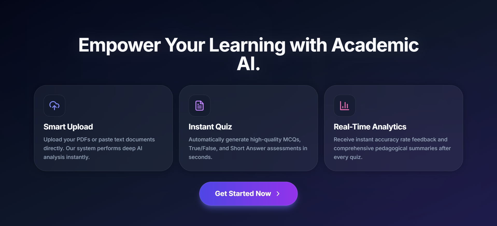
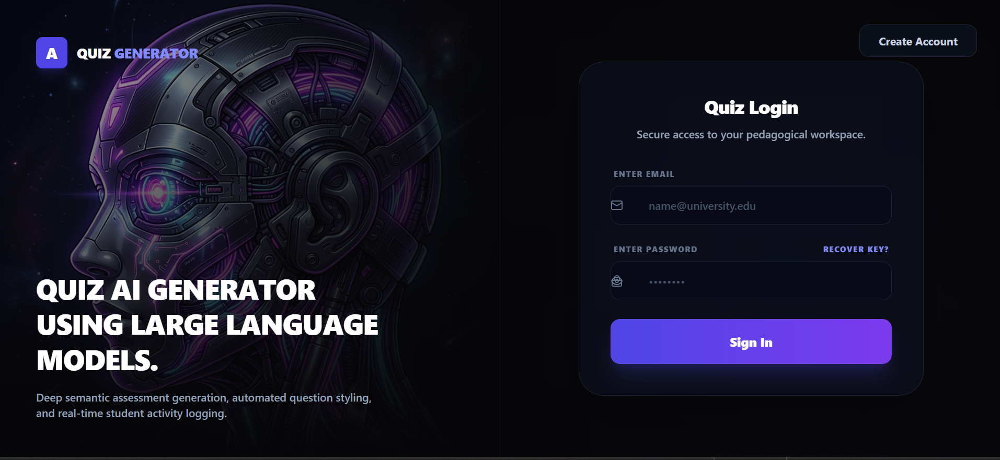
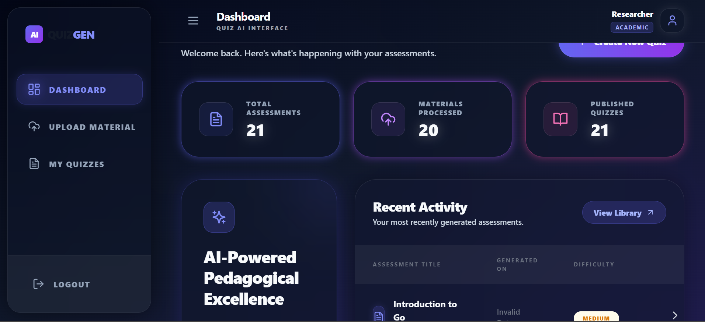

# 🧠 Instant Student Quiz Generator (Academic AI)

An advanced, AI-powered educational assessment platform designed to help students evaluate their learning retention instantly. By analyzing uploaded PDFs or text documents, the system leverages state-of-the-art Large Language Models (LLMs) to automatically generate high-quality, multi-format quizzes. Built with an elegant **Aura Glass** theme, micro-interactions, and high-performance engineering.

---

## 🚀 Key Features

* **Smart Content Analysis:** Deep AI parsing of uploaded PDFs, text documents, or pasted study materials.
* **Multi-Format Quiz Generation:** Automatically creates Multiple Choice Questions (MCQs), True/False statements, and Short Answers in seconds.
* **Real-Time Pedagogical Feedback:** Delivers immediate scoring, accuracy rates, and comprehensive summaries explaining *why* answers are correct or incorrect.
* **Premium Aura Glass UI:** A modern, high-contrast user interface with seamless, fluid layout animations managed by Framer Motion.
* **Direct Authentication Flow:** Secured system access routing that forces a clean entry structure: `Get Started -> Login -> Dashboard`.

---

## 🛠️ Tech Stack

### Frontend
* **Framework:** React.js (Vite)
* **Styling:** Tailwind CSS (Aura Glass Customizations & Invisible Scroll Architecture)
* **Animations:** Framer Motion
* **Icons:** Lucide React

### Backend & Database
* **Language:** Go (Golang)
* **Router / Framework:** Gin Gonic
* **Database:** PostgreSQL (Core Schemas) & Firebase (User Management)
* **AI Engine Integration:** Google Gemini API / OpenAI GPT-4

---

## ⚙️ Setup & Installation

Follow these steps to clone, configure, and run the entire system locally.

### Prerequisites
* Node.js (v18 or higher)
* Go (v1.20 or higher)
* PostgreSQL instance running locally or on the cloud

---

### 1. Backend Setup (Go)

1. Navigate to the backend directory:
   ```bash
   cd backend
   2. 
 PORT=9090
DB_HOST=localhost
DB_USER=your_postgres_user
DB_PASSWORD=your_postgres_password
DB_NAME=quiz_generator_db
DB_PORT=5432

# AI Configuration
GEMINI_API_KEY=your_valid_google_gemini_api_key


Download dependencies and run the server:
go mod tidy
go run main.go

Frontend Setup (React)
Navigate to the frontend directory:
cd frontend
npm install
Start the frontend development server:
npm run dev


## 📸 System Screenshots

Here is a visual overview of the **Academic AI** platform showcasing the premium **Aura Glass** user interface, clean typography, and optimized responsive layouts.

### 1. Welcome & Entry Point (`/`)
The **Get Started** page welcomes users with fluid animations, introducing the 3 core pillars of the system (Upload, Generate, Analyze) before offering a high-contrast transition button

<p align="center">
  
</p>


2. Authentication Portal (`/login`)
A highly translucent glassmorphism login panel featuring high-contrast text fields, secure authentication, and optimized micro-interactions

<p align="center">
  
</p>


Educator & Student Dashboard (`/dashboard`)
The central hub displaying immediate stat cards for generated metrics, dynamic asset tables, and clean navigation with hidden scroll functionality.


<p align="center">
  
</p>